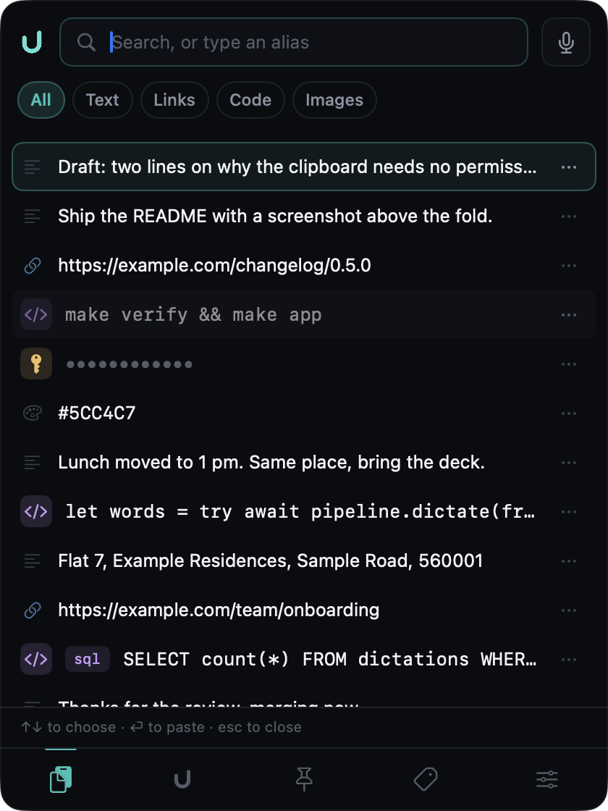

# Uttrflow

[](https://github.com/uttrflow/uttrflow-swift/actions/workflows/ci.yml)
[](https://github.com/uttrflow/uttrflow-swift/actions/workflows/codeql.yml)
[](https://scorecard.dev/viewer/?uri=github.com/uttrflow/uttrflow-swift)
[](LICENSE)
[](https://github.com/uttrflow/releases/releases/latest/download/Uttrflow.dmg)

**A native macOS clipboard manager with dictation built in.** Everything you copy is a
keystroke away, and you can speak into any application instead of typing. Speech becomes
text on your own Mac; nothing you copy or say leaves it.

<p align="center">
  
</p>

<p align="center"><sub>⇧⌘V opens it over whatever you are typing in. ↑↓ to choose, ⏎ to paste, Esc to close. The masked row is a token; it stays masked until you ask.</sub></p>

## Install

Apple Silicon Mac, macOS 26 or later.

```bash
brew install --cask uttrflow/tap/uttrflow
```

Or download [`Uttrflow.dmg`](https://github.com/uttrflow/releases/releases/latest/download/Uttrflow.dmg)
and drag it to Applications. Either way the app updates itself from then on.

The build is not yet notarised by Apple, so the first launch is refused with *"Uttrflow is
damaged and can't be opened"*. It is not damaged; macOS says that about any download it has
not seen a signature for. Clear the quarantine flag once and it opens:

```bash
xattr -dr com.apple.quarantine /Applications/Uttrflow.app
```

Homebrew quarantines what it downloads too, so the command is needed after either install.

## Use

- **⇧⌘V** opens the clipboard over whatever you are typing in. Type to filter, or type an
  alias you gave a clip. ↑↓ to choose, ⏎ to paste where the caret already was, **⌘⏎** to
  paste as plain text however it was copied, Esc to close. The window underneath never loses
  focus.
- **Hold ⌥Space** and talk. Let go, and the words land at the cursor in the app you were
  already in. The floating button at the screen edge shows the microphone level while you
  hold it, and the shortcut can be changed in Settings.
- **Dictionary.** A name the recogniser keeps getting wrong is fixed once; matching is by
  sound, so spellings you have not seen yet are caught too.

The first dictation asks for the microphone, and typing into another app needs
Accessibility. The clipboard needs neither to open.

## What it does

**The clipboard** records text, links, code, colours, images and file paths, and works out
which is which rather than asking. Code gets a language chip, can be re-indented, and can
be run through a formatter you already have installed — the diff is shown first, and the
result is compared token for token with what went in and discarded if it differs. Clips can
be pinned, filed into folders (⌘2 upwards), renamed and deleted. Anything that looks like a
secret is masked at a fixed width that does not reveal its length, and gets no tooltip.

**Dictation** is push-to-talk and on-device. Recognition runs through WhisperKit or Apple's
speech recogniser, then a clean-up stage turns what was said into what was meant: fillers
go, punctuation arrives, and the words in your dictionary are spelled your way. Each engine
declines what it cannot handle, so a language Apple's model does not cover is routed to one
that does.

**Works offline.** Sign in needs a network exactly once. After that every launch, every
dictation and every paste works with Wi-Fi off — proven by a sandbox that fails any test
touching the network.

## It runs without an account, and without anything of ours

Worth saying early, because it is the question every reader of a client repository has:
**you do not need an account, an API key, or access to any server we run.**

Dictation is on-device. The clipboard, history, dictionary and snippets live in Application
Support and are never sent anywhere. The one screen that would need a network — sign-in —
offers **"continue on this Mac"** beside the providers, which uses the name macOS already
knows you by and needs nothing. An account buys the things that genuinely need one:
carrying a dictionary between Macs, and a subscription to bill.

So a clone builds, tests and runs, complete. See [`CONTRIBUTING.md`](CONTRIBUTING.md).

## Install

To install via Homebrew:

```bash
  brew install --cask uttrflow/tap/uttrflow
```

Or download the latest .dmg installer:

```bash
  https://img.shields.io/badge/download-latest-brightgreen.svg
```

## Requirements

- Apple Silicon Mac, macOS 26 or later
- Xcode 26.6 or later (supplies the toolchain; the build itself is SwiftPM)
## Building it

Xcode 26.6 or later supplies the toolchain; the build itself is SwiftPM.

```bash
make verify     # lint, PII audit, build, 4,000+ tests, coverage floor, offline audit
make app        # builds and ad-hoc signs dist/Uttrflow.app
open dist/Uttrflow.app
make help       # every target
```

Optionally, to make the sign-in buttons look like the shipping app:

```bash
./Scripts/fetch-provider-marks.sh
```

That fetches Google's mark from Google. It is not in this repository — it is their
trademark, not ours — and nothing needs it: without it the button carries its wording
alone, exactly as the GitHub button does in every build.

`make app` signs ad-hoc, which is enough to run here and to keep the permission grants
across rebuilds, but Gatekeeper will refuse the bundle on a Mac that did not build it.
**To put a build on another Mac, or to release one, see [`Docs/releasing.md`](Docs/releasing.md).**
`Docs/packaging.md` explains why the app is built with `xcodebuild` rather than
`swift build`.

## How the code is arranged

All the deciding lives in Swift Package Manager modules; the app target holds windows,
menu items and SwiftUI views, and no judgement at all. That split is deliberate: it means
`swift test` exercises the entire product headlessly, with no simulator, no UI runner and
no Xcode scheme.

```
Sources/
  UttrflowCore         Protocols, models, errors, metrics. Pure stdlib — no platform imports.
  UttrflowAudio        Microphone capture, resampling, WAV encoding, file reading.
  UttrflowSpeech       Speech to text. One engine, two interchangeable recognisers.
  UttrflowAI           Turning a transcript into the words the speaker meant.
  UttrflowContext      What is on screen, so terms and names can be got right.
  UttrflowInput        Getting finished text into whatever the user is typing in.
  UttrflowPipeline     The sequence: listen, transcribe, tidy, insert. And cancelling it.
  UttrflowSettings     What the user chose, kept between launches.
  UttrflowHistory      What was dictated, kept between launches and aged out on a clock.
  UttrflowDictionary   Words you say that a general model does not know, found by sound.
  UttrflowAccount      Who is signed in, and what their subscription allows.
  UttrflowClipboard    Clipboard history and the panel that shows it.
  UttrflowUX           What every window and menu should say, decided without drawing it.
  UttrflowPermissions  Reading and requesting what macOS gates the pipeline behind.
  UttrflowEval         Scoring how well it hears and how well it tidies. No model near it.
  UttrflowLocalModel   An open-weight model on the GPU, for languages Apple's misses.
  UttrflowTestSupport  Fakes and fixtures shared by every test target. Never shipped.
  Uttrflow             The app. Windows and wiring only.
  uttrflow-dev         Developer harness. One command per stage of the pipeline.
  uttrflow-eval        Word error rate and latency, against passages read aloud.
                      Never linked into the app: it can reach the private corpus.
  uttrflow-bakeoff     Scores every clean-up engine against the corpus.
```

Each capability is defined once, as a protocol in `UttrflowCore`, and implemented in
its own module. Nothing above the protocol layer — not the pipeline, not a view —
refers to a concrete engine. [`Docs/`](Docs/) has a page per subsystem, from
[insertion](Docs/insertion.md) and its traps to [how accuracy is measured](Docs/measuring-accuracy.md).

## Trying the pipeline from a terminal

```bash
swift run uttrflow-dev doctor                 # permissions and audio hardware
swift run uttrflow-dev models install         # one-time, 646 MB
swift run uttrflow-dev record -s 5            # record 5s, write a WAV
swift run uttrflow-dev transcribe -s 6        # record and transcribe
swift run uttrflow-dev transcribe voice.wav   # transcribe a file
swift run uttrflow-dev transcribe -e appleSpeech -s 6
swift run uttrflow-dev clean "um so i think the the deployment is uh still running"
swift run uttrflow-dev insert "Hello from Uttrflow."   # needs Accessibility access
```

`record` asks for microphone access the first time. Run from a terminal, the permission
belongs to the terminal app rather than to Uttrflow — real first-run behaviour can only
be checked once the app bundle exists.

## Choosing engines

Which implementations run is decided entirely by `EngineConfiguration`:

```swift
EngineConfiguration(
    speech: .whisperKit,                                    // or .appleSpeech
    transformerPreference: [.foundationModels, .localModel, .rules]
)
```

Clean-up engines are tried in order, and the first one that reports itself able to
handle the request wins. An engine that cannot cope with the spoken language steps
aside rather than producing bad output — which is how Hindi is routed away from
Apple's model, whose 23 supported locales do not include it. The preference list must
always end in `.rules`, which can handle anything, so the pipeline can never dead-end.

`.cloud` is compiled in only when `UTTRFLOW_CLOUD` is defined. The shipping binary
contains no network path.

## Two build paths

`make verify` builds, tests and gates the whole product with `swift build` — that is the
everyday path, and the pre-push hook needs nothing else.

Two things go through `xcodebuild` instead. The app, because of the resource-bundle
problem described in `Docs/packaging.md`. And `UttrflowLocalModel` with `uttrflow-bakeoff`,
because they link MLX, whose Metal shaders SwiftPM's command line cannot compile:

```bash
xcodebuild -downloadComponent MetalToolchain   # once, ~690 MB, only for the bake-off
make bakeoff                                   # scores every clean-up engine
```

MLX is quarantined in that one module and that one executable on purpose, so the everyday
tools, the tests, the pre-push gate — and `make app` — never need the Metal toolchain.

## Quality bar

- 95% line coverage per module, enforced by `Scripts/coverage.sh` and the pre-push gate
- Swift 6 language mode, strict concurrency, warnings as errors
- No force unwraps, no force try, no implicitly unwrapped optionals (lint-enforced)
- A PII audit runs first in `make verify`, so no real name, address or credential can be
  committed by accident

## Privacy

Dictation happens entirely on your Mac. **Audio is kept on this Mac for a day, and only so a
failed dictation can be retried**: every recording is written beside the buffer the
recogniser reads and deleted the moment the words land. If the words are lost — the
recogniser fails, or the app dies mid-dictation — the recording stays for a day and sits at
the top of the Dictation page with a Retry. Nothing about it leaves the Mac. See
[`Docs/recordings.md`](Docs/recordings.md). The text is kept locally so you can copy or
re-insert it, and deleted after its retention window. Your dictionary, your history and
your settings are files on this Mac; signing out does not remove them, and only Reset does.

**A clipboard manager records everything you copy, and this one is no exception.** Text,
links, code and images all go into `~/Library/Application Support/Uttrflow` — plain JSON
with the pictures as PNG files beside it, at ordinary file permissions. It is not
encrypted, so anything running as you can read it. Clips age out after the retention
window (seven days by default, five hundred clips) unless you pin them. None of it leaves
this Mac: there is no clipboard sync.

Two things are owed here, and until they are done this is worth knowing:

- **Uttrflow does not honour the concealed-pasteboard convention.** Password managers mark
  a copied password so that clipboard managers skip it. Uttrflow does not read that mark
  yet, so a password copied out of one is captured like anything else.
- **There is no way to pause capture or exclude an application.** Every copy is recorded
  while the app is running.

Clips that look like secrets are masked in the panel until you ask to see them, at a
fixed width that does not reveal how long the token is, and they get no tooltip. That is
a rule about the screen — about somebody reading over your shoulder, or a shared screen —
and not about the disk. The text is stored in the clear like every other clip.

**There is an account, and it is required to dictate.** Signing in needs a network exactly
once; every launch after that works without one, and an entitlement that has aged out
still lets you dictate rather than locking you out.

**Nothing is sent, and the telemetry that will be sent can only carry numbers.** The app
does not report anything today: the collector exists, is tested, and is wired to nothing,
so no measurement leaves this Mac. What it is built to carry is counts, durations, words
per minute, language mix, which stage failed, latency percentiles — and it is not that we
choose not to send your words, it is that the type that gets encoded has no field capable
of holding text at any depth, and a test walks it and fails on anything `String`-shaped.
Audio, transcripts, dictionary contents, window titles and application names have nowhere
to go. There is no opt-out switch, because there is nothing yet to opt out of. Before
anything is ever sent there will be one, and a way to read exactly what was sent.

The app is not hermetic and does not claim to be: it downloads a speech model on first run,
roughly 646 MB, and signs you in once. After that it dictates with no network at all. A
cloud clean-up engine exists behind the `UTTRFLOW_CLOUD` compilation flag and is **not** in
the shipping binary, and the evaluation corpus is not a library product so it cannot be
imported into the app.

## Contributing

Issues labelled [good first issue](https://github.com/uttrflow/uttrflow-swift/issues?q=is%3Aissue+is%3Aopen+label%3A%22good+first+issue%22)
are small, self-contained, and checked to be real before they are filed. Questions and
ideas go in [Discussions](https://github.com/uttrflow/uttrflow-swift/discussions).

- [`CONTRIBUTING.md`](CONTRIBUTING.md) — how a change gets in, and what review looks for
- [`RELEASING.md`](RELEASING.md) — how a release is cut, and why there is no staging branch
- [`SECURITY.md`](SECURITY.md) — reporting a vulnerability, and what runs automatically
- [`CHANGELOG.md`](CHANGELOG.md) — what changed, per version

## Licence

MIT — see [`LICENSE`](LICENSE). The code is yours to fork, modify and ship, commercially
included.

The name and the mark are not covered by it, and MIT has no trademark clause of its own,
so [`TRADEMARK.md`](TRADEMARK.md) says the one thing this asks of a fork: give it your own
name and your own icon. Somebody who cannot tell a fork from the original cannot make an
informed decision about what is reading their microphone.

Sign-in provider marks belong to their owners and are not in this repository at all; see
`Scripts/fetch-provider-marks.sh`.
